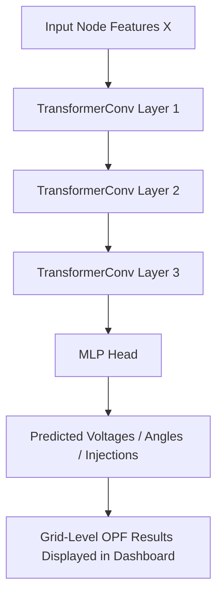

# VoltNet: AI-Powered Optimal Power Flow Prediction using GNN

> Real-time OPF prediction using Graph Neural Networks for efficient renewable energy integration and smart grid management.

---

### Live Demo  
**Frontend:** [https://volt-net.vercel.app](https://volt-net.vercel.app)  
**Backend API (Docs):** [https://volt-net-api.onrender.com/docs](https://volt-net-api.onrender.com/docs)

---

## Overview

**VoltNet** is an AI-driven surrogate model for **Optimal Power Flow (OPF)** — a key problem in power system operations.  
Instead of solving slow, iterative optimization problems, VoltNet uses a **Graph Neural Network (GNN)** to predict OPF solutions (like voltages, angles, and injections) in **milliseconds**.

This allows grid operators to:
- React faster to fluctuations in **renewable energy generation**  
- Run **thousands of simulations per second** for planning  
- Perform **contingency analysis and real-time control**

---

## Key Features

**Instant OPF Predictions** – Replace slow numerical solvers with an efficient GNN-based surrogate  
**Graph Representation of Power Grid** – Nodes = buses, Edges = transmission lines  
**Renewable Integration Support** – Trained on datasets with variable renewable energy inputs  
**Deployed API & Web Interface** – Interactive dashboard for OPF prediction  
**Scalable and Extensible** – Works for microgrids or large transmission systems  

---

## Model Architecture

VoltNet uses a **Surrogate Graph Neural Network (SurrogateGNN)** that maps node and edge features of the grid to per-node OPF outputs.

## Why VoltNet Matters for Renewable Energy

As renewable sources like solar and wind fluctuate rapidly, maintaining power balance in the grid becomes a major challenge.
Traditional OPF solvers take seconds to minutes per run, making real-time adjustments nearly impossible.
VoltNet enables:
- Millisecond-level prediction of voltage and power flows
- Better handling of renewable fluctuations (predicting effects of wind/solar variability)
- Fast scenario simulation for demand-response or energy storage operations
- Smarter, more sustainable grids with AI-assisted optimization

## System Design

# Components
- Frontend (React + Tailwind) – Provides user-friendly dashboard for predictions
- Backend (FastAPI + PyTorch) – Serves GNN-based inference and handles pre/post-processing
- Model Artifacts – Trained SurrogateGNN, scalers, and edge/node metadata
- Dockerized Deployment – Seamlessly deployable on Render / Vercel
 
