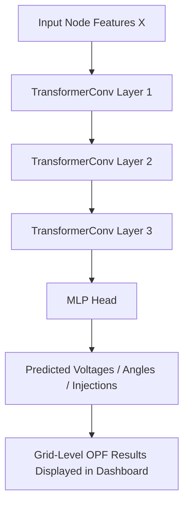

# VoltNet: AI-Powered Optimal Power Flow Prediction using GNN

> Real-time OPF prediction using Graph Neural Networks trained on real IEEE power system datasets

---

## 🚀 Quick Start - Train on Real IEEE Dataset

### Prerequisites
- Python 3.8+
- Virtual environment with dependencies installed

### Training (3 Steps)

#### 1. Ensure Dataset is Extracted
```
dataset_pf_opf/
├── ieee24/
├── ieee39/  ← Recommended
├── ieee118/
└── uk/
```

#### 2. Run Training
```bash
# Windows
START_TRAINING.bat

# Or manually
venv\Scripts\activate
python train_ieee_model.py --bus_system ieee39 --epochs 50
```

#### 3. Start Application
```bash
cd backend
python app.py
# Open http://localhost:8000
```

---

## 📊 Available Datasets

| Dataset | Nodes | Training Time | Recommended |
|---------|-------|---------------|-------------|
| IEEE24 | 24 | 10-15 min | Quick test |
| **IEEE39** | 39 | 20-30 min | **✅ Best choice** |
| IEEE118 | 118 | 1-2 hours | Advanced |
| UK | Variable | Variable | Real-world |

---

## 🎯 Training Options

```bash
# Quick test (10 epochs)
python train_ieee_model.py --bus_system ieee39 --epochs 10

# Full training (50 epochs)
python train_ieee_model.py --bus_system ieee39 --epochs 50

# Advanced (IEEE118, 100 epochs)
python train_ieee_model.py --bus_system ieee118 --epochs 100 --batch_size 16
```

---

## Overview

**VoltNet** is an AI-driven surrogate model for **Optimal Power Flow (OPF)** — a key problem in power system operations.  
Instead of solving slow, iterative optimization problems, VoltNet uses a **Graph Neural Network (GNN)** to predict OPF solutions (like voltages, angles, and injections) in **milliseconds**.

This allows grid operators to:
- React faster to fluctuations in **renewable energy generation**  
- Run **thousands of simulations per second** for planning  
- Perform **contingency analysis and real-time control**

---

## Key Features

**Instant OPF Predictions** – Replace slow numerical solvers with an efficient GNN-based surrogate  
**Graph Representation of Power Grid** – Nodes = buses, Edges = transmission lines  
**Renewable Integration Support** – Trained on datasets with variable renewable energy inputs  
**Docker Deployment** – One-command deployment with health monitoring  
**Interactive Web Interface** – Real-time dashboard for OPF prediction  
**Scalable and Extensible** – Works for microgrids or large transmission systems  

---

## Model Architecture

VoltNet uses a **Surrogate Graph Neural Network (SurrogateGNN)** that maps node and edge features of the grid to per-node OPF outputs.



## Why VoltNet Matters for Renewable Energy

As renewable sources like solar and wind fluctuate rapidly, maintaining power balance in the grid becomes a major challenge.
Traditional OPF solvers take seconds to minutes per run, making real-time adjustments nearly impossible.
VoltNet enables:
- Millisecond-level prediction of voltage and power flows
- Better handling of renewable fluctuations (predicting effects of wind/solar variability)
- Fast scenario simulation for demand-response or energy storage operations
- Smarter, more sustainable grids with AI-assisted optimization

## 📁 Project Structure

```
VoltNet/
├── backend/                 # FastAPI backend
│   ├── app.py              # Main API application
│   ├── model.py            # ML model definitions
│   ├── model_loader.py     # Model loading utilities
│   ├── artifacts/          # Pre-trained models and data
│   ├── Dockerfile          # Backend container config
│   └── requirements.txt    # Python dependencies
├── frontend/               # Web frontend
│   ├── index.html          # Main web page
│   ├── script.js           # Frontend logic
│   ├── style.css           # Styling
│   ├── api.js              # API communication
│   ├── config.js           # Configuration
│   ├── static/             # Static assets
│   ├── Dockerfile          # Frontend container config
│   └── nginx.conf          # Nginx configuration
├── docker-compose.yml      # Multi-container setup
├── deploy.sh              # Linux/Mac deployment script
└── deploy.bat             # Windows deployment script
```

## System Design

### Components
- **Frontend** (HTML/JS + Nginx) – Interactive dashboard for OPF predictions
- **Backend** (FastAPI + PyTorch) – Serves GNN-based inference and handles pre/post-processing
- **Model Artifacts** – Trained SurrogateGNN, scalers, and edge/node metadata
- **Docker Deployment** – Seamlessly deployable with health monitoring

## 🛠️ Development

### Backend Development
```bash
cd backend
pip install -r requirements.txt
python app.py
```

### Frontend Development
Serve the frontend directory with any web server:
```bash
cd frontend
python -m http.server 8080
```

## 📊 API Endpoints

- `GET /` - API status
- `GET /health` - Health check
- `POST /predict_opf` - Power flow optimization prediction

### Prediction Request Format
```json
{
  "renewable_pct": 50.0,
  "battery_soc": 75.0,
  "load_factor": 100.0,
  "baseline_idx": 0
}
```

## 🐳 Docker Services

- **Backend**: FastAPI app on port 8000
- **Frontend**: Nginx server on port 80
- **Volumes**: ML artifacts mounted for persistence
- **Networks**: Internal Docker network for service communication
- **Health Checks**: Automatic service monitoring and restart

## 🔍 Troubleshooting

Check service logs:
```bash
docker-compose logs backend
docker-compose logs frontend
```

Restart services:
```bash
docker-compose restart
```

## 📝 License

This project is part of a hackathon submission for power grid optimization.
